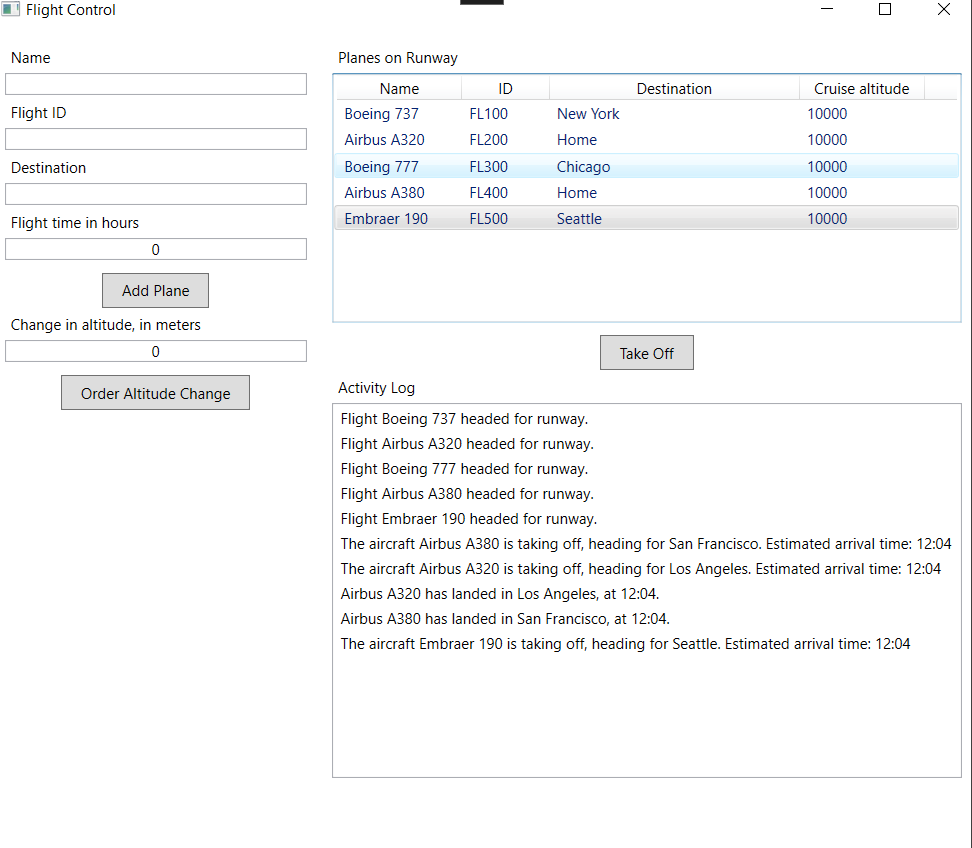

<!-- PROJECT SHIELDS -->
[![Contributors][contributors-shield]][contributors-url]
[![Forks][forks-shield]][forks-url]
[![Stargazers][stars-shield]][stars-url]
[![Issues][issues-shield]][issues-url]
[![MIT License][license-shield]][license-url]
[![LinkedIn][linkedin-shield]][linkedin-url]

<!-- PROJECT LOGO -->
 

<!--   -->

<h3 align="center">FlightControl</h3>

  

    A practise WPF application that simulates an airfield control tower.
     
    <a href="https://github.com/mavosy/FlightControl"><strong>Explore the docs »</strong></a>
     
     
    <a href="https://github.com/mavosy/FlightControl/issues/new?labels=bug&template=bug-report---.md">Report Bug</a>
    ·
    <a href="https://github.com/mavosy/FlightControl/issues/new?labels=enhancement&template=feature-request---.md">Request Feature</a>
  

<!-- TABLE OF CONTENTS -->

  
Table of Contents

  <ol>
    <li>
      <a href="#about-the-project">About The Project</a>
      <ul>
        <li><a href="#built-with">Built With</a></li>
      </ul>
    </li>
    <li>
      <a href="#getting-started">Getting Started</a>
      <ul>
        <li><a href="#prerequisites">Prerequisites</a></li>
        <li><a href="#installation">Installation</a></li>
      </ul>
    </li>
    <li><a href="#usage">Usage</a></li>
    <li><a href="#roadmap">Roadmap</a></li>
    <li><a href="#license">License</a></li>
    <li><a href="#contact">Contact</a></li>
  </ol>

<!-- ABOUT THE PROJECT -->
## About The Project

  

**FlightControl** is only a practise project, trying to work with **events**, **delegates** and **MVVM** in an organized manner.

**FlightControl** is a **WPF**-based desktop application that simulates and manages flight-related tasks such as planning or monitoring. This application provides a simple and  interface for interacting with flights, enabling users to make  decisions based on current flight conditions or schedules.

The application is built using the **Model-View-ViewModel** (MVVM) design pattern and **WPF**. Users can enter data, manipulate flight details, and track updates.

(<a href="#readme-top">back to top</a>)

### Built With

* [![C#][csharp-shield]][csharp-url]
* [![WPF][wpf-shield]][wpf-url]
* MVVM Pattern

(<a href="#readme-top">back to top</a>)

<!-- GETTING STARTED -->
## Getting Started

Follow these steps to get a local copy up and running.

### Prerequisites

- .NET 6.0 SDK or later
- Visual Studio 2022 or another IDE with WPF support

### Installation

1. Clone the repo.

2. Open the solution in Visual Studio, restore NuGets and build the project.

3. Order takeoff!

(<a href="#readme-top">back to top</a>)

<!-- USAGE EXAMPLES -->
## Usage

1. Launch the application.
2. Add flights.
3. Make the flights take off.
4. Change flight altitude in-air.
5. Hold your breath as the flight makes a daring landing.. ^^

(<a href="#readme-top">back to top</a>)

<!-- ROADMAP -->
## Roadmap

UI Enhancements:
- [ ] Modernize the UI.
- [ ] Add custom themes and dark mode support.

Flight Data Management:
- [ ] Implement the ability to import and export flight schedules in common formats (CSV, JSON).
- [ ] Add advanced filtering and search capabilities for flight data.
- [ ] Expand the application to support other travel-related logistics (e.g., passenger management, cargo flights).

Real-Time Updates from real planes:
- [ ] Integrate real-time data updates from (real) external flight tracking APIs, making a real use-case of this practise app.
- [ ] Allow real-time monitoring of flight conditions like delays or cancellations.
- [ ]  Introduce notifications or alerts for critical flight status changes.

Testing and Performance:
- [ ] Add unit tests.
- [ ] Improve application performance for handling larger datasets, maybe with paralell execution.

See the [open issues](https://github.com/mavosy/FlightControl/issues) for a full list of proposed features (and known issues).

(<a href="#readme-top">back to top</a>)

<!-- CONTRIBUTING -->
## Contributing

Contributions are what make the open source community such an amazing place to learn, inspire, and create. Any contributions you make are **greatly appreciated**.

If you have a suggestion that would make this better, please fork the repo and create a pull request. You can also simply open an issue with the tag "enhancement".
Don't forget to give the project a star! Thanks again!

1. Fork the Project
2. Create your Feature Branch (`git checkout -b feature/AmazingFeature`)
3. Commit your Changes (`git commit -m 'Add some AmazingFeature'`)
4. Push to the Branch (`git push origin feature/AmazingFeature`)
5. Open a Pull Request

(<a href="#readme-top">back to top</a>)

### Top contributors:

<!-- LICENSE -->
## License

Distributed under the MIT License. See `LICENSE.txt` for more information.

(<a href="#readme-top">back to top</a>)

<!-- CONTACT -->
## Contact

mavosy - maltesydow@gmail.com

Project Link: [https://github.com/mavosy/FlightControl](https://github.com/mavosy/FlightControl)

(<a href="#readme-top">back to top</a>)

<!-- MARKDOWN LINKS & IMAGES -->
<!-- https://www.markdownguide.org/basic-syntax/#reference-style-links -->
[contributors-shield]: https://img.shields.io/github/contributors/mavosy/FlightControl.svg?style=for-the-badge
[contributors-url]: https://github.com/mavosy/FlightControl/graphs/contributors
[forks-shield]: https://img.shields.io/github/forks/mavosy/FlightControl.svg?style=for-the-badge
[forks-url]: https://github.com/mavosy/FlightControl/network/members
[stars-shield]: https://img.shields.io/github/stars/mavosy/FlightControl.svg?style=for-the-badge
[stars-url]: https://github.com/mavosy/FlightControl/stargazers
[issues-shield]: https://img.shields.io/github/issues/mavosy/FlightControl.svg?style=for-the-badge
[issues-url]: https://github.com/mavosy/FlightControl/issues
[license-shield]: https://img.shields.io/github/license/mavosy/FlightControl.svg?style=for-the-badge
[license-url]: https://github.com/mavosy/FlightControl/blob/master/LICENSE.txt
[linkedin-shield]: https://img.shields.io/badge/-LinkedIn-black.svg?style=for-the-badge&logo=linkedin&colorB=555
[linkedin-url]: https://linkedin.com/in/malte-von-sydow
[csharp-shield]: https://custom-icon-badges.demolab.com/badge/C%23-%23239120.svg?logo=cshrp&logoColor=white
[csharp-url]: https://learn.microsoft.com/en-us/dotnet/csharp/
[wpf-shield]: https://img.shields.io/badge/WPF-512BD4?style=for-the-badge&logo=windows&logoColor=white
[wpf-url]: https://learn.microsoft.com/en-us/dotnet/desktop/wpf/
